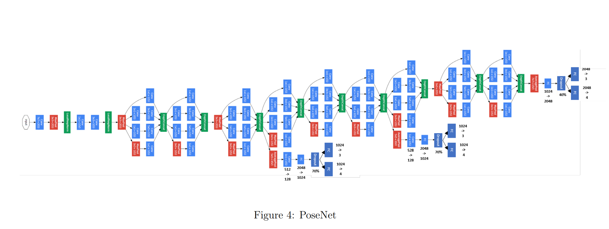
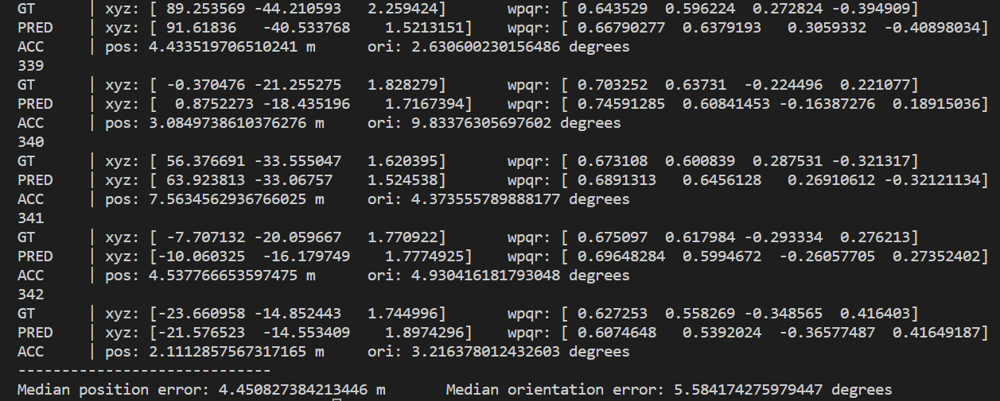

# PoseNet
A fundamental implementation of PoseNet, a type of pose regression model.

## Introduction
At its core, PoseNet is a convolutional neural network and uses convolutional layers to learn the features of the training images. These features are then used to learn specific properties present in the images, such as the camera position. CNNs tend to be very deep and hard to train, especially without large GPUs. Because of this, PoseNet relies on a pre-trained "general-purpose feature extractor".

## Architecture
The architecture of the PoseNet consists of a series of InceptionBlocks that lead into three loss headers. Each of these loss headers predicts an xyz position and a wpqr orientation. The position is predicted as a 3D coordinate and the orientation as a Quaternion in wpqr ordering.
The architecture is as follows:

## Dataset 
The neural network is trained on the KingsCollege Dataset. It is a large scale outdoor localisation dataset. It consists of video recordings and images of buildings around Cambridge University. The dataset can be downloaded from [here](https://www.repository.cam.ac.uk/bitstream/handle/1810/251342/KingsCollege.zip).

## Implementation
The implementation of the Pose regression archtiecture has two stages:
1. Pre-Processing: During the pre-processing phase three steps occur:
   1. Image resizing: Images are re-sized from 1920x1080 resolution to 480x256. 
   2. Subtraction from Mean image: The mean image is calculated and each image in the dataset is subtracted from the mean image to      produce new images with reduced contrast.
   3. Normalization and Random Cropping: The images are then normalized with a mean and standard deviation of 0.5. During the            training phase, a random 224x224 piece of the image is cropped out and used, while during testing a center 224x224 crop is used      on the image.This is done because the Inception architecture that runs as the backbone for the PoseNet only accepts images of        size 224x224.
2. Model Training: The PoseNet model was run for 240 epochs at a learning rate of 1e-4, with a batch size of 100. Training was optimized using the Adam Optimizer. 

The mean image and an output sample from subtracting from the mean image are shown below:

Mean Image

Subtracted Image

## Results
The model was trained on a loss function that considered parameters for both position and orientation. Each of the three loss headers described in the architecture contribute to the loss, with the third loss header contributing the highest. The parameter beta, directs which of the two - positional or orientational - loss should be focused on more. Whereas the w parameter reduces the auxilliary losses.

There are two evaluation metrics used for evaluation; Median Position Error and Median Orientation Error. The median position error represents the median deviation in position from the ground truth camera position in metres. The median orientation error represents the median angle devaition from the true camera orientation in degrees.

The results obtained based on the above metrics are shown below:

